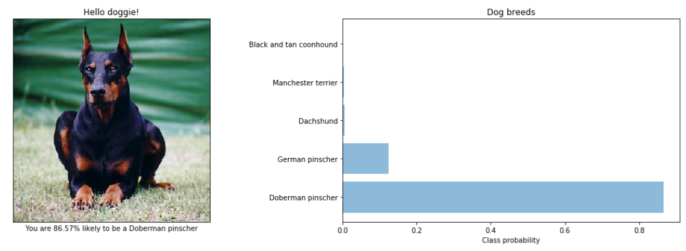

## Project Overview

In this notebook an algorithm is developed to classify images of humans and dogs, that could be used as part of a mobile or web app.  The code accepts any user-supplied image as input.  If a dog is detected in the image, it provides an estimate of the dog's breed.  If a human is detected, it provided an estimate of the dog breed that is most resembling.  The image below displays a sample output.

## Datasets

The following datasets are used to train the models:

* [Dog dataset](https://s3-us-west-1.amazonaws.com/udacity-aind/dog-project/dogImages.zip) consists of 8351 dog images.

* [Human dataset](https://s3-us-west-1.amazonaws.com/udacity-aind/dog-project/lfw.zip) consists of 13233 human images.

## General Outline

The notebook is split into the following steps:

* **Step 0**: Import Datasets
* **Step 1**: Detect Humans
* **Step 2**: Detect Dogs
* **Step 3**: Create a CNN to Classify Dog Breeds (from Scratch)
* **Step 4**: Create a CNN to Classify Dog Breeds (using Transfer Learning)
* **Step 5**: Create the Algorithm
* **Step 6**: Test the Algorithm

